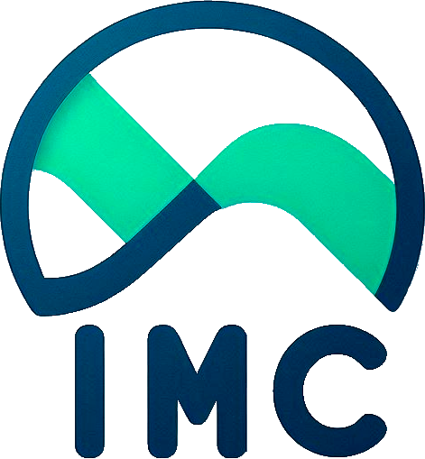

# Calculadora de IMC

Este aplicativo foi desenvolvido para calcular o Índice de Massa Corporal (IMC) e fornecer informações sobre a saúde com base nos resultados obtidos. 

É importante lembrar que as informações apresentadas no aplicativo não substituem o acompanhamento médico. Consulte um profissional de saúde para orientações específicas.

Todas as informações do aplicativo foram retiradas do site da Abeso: [Calculadora IMC](https://abeso.org.br/obesidade-e-sindrome-metabolica/calculadora-imc/)

## Capturas de Tela

### Logo

### Tela Inicial

### Calcular IMC

### Cadastrar Pessoa

### Histórico de Cálculos

### Sobre o App

